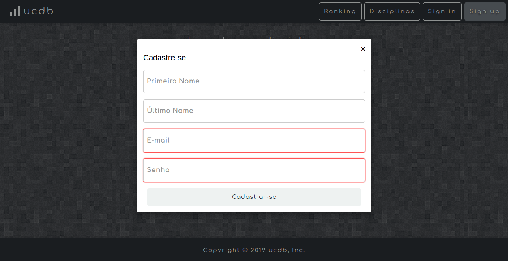

# UCDb: classificações e reviews de cursos da UFCG

 
  

## Descrição
O UFCG Cursos database é uma aplicação para classificação e reviews de disciplinas de cursos da UFCG. Por enquanto, a versão 1 do sistema será alimentada apenas com disciplinas do curso de Ciência da Computação. Os usuários dessa aplicação irão construir conteúdo sobre as disciplinas de forma colaborativa através de comentários e likes nas disciplinas. O sistema deve usar essa informação construída para rankear as disciplinas do curso.

## Link para o FrontEnd
O FrontEnd da aplicação pode ser visto através do link: http://ucdb-client.herokuapp.com/

## Link para o código do BackEnd
O código do BackEnd da aplicação pode ser visto através do link: https://github.com/eduhique/Psoft-Backend

## Tecnologias usadas
Foi usado HTML5, CSS3, e ES6 para fomentação do FrontEnd. Além de bibliotecas externas para importação de fontes, ícones e estilos. Não foram usados frameworks neste projeto.

## Padrão usado
O padrão de projeto foi o MVVM

## Funcionalidades:

  ### Cadastrar/autenticar usuários:
  É possível o usuário se cadastar e se logar dentro do sistema para ter acesso às demais funcionalidades.
  
 
    
  

  
 
    
  

      
  ### Pesquisar disciplinas a partir de uma (sub)string:
  O usuário pode pesquisar por uma disciplina por um pedacinho do seu nome, ou então, pelo nome completo.
  
 
    
  

  ### Recuperar o perfil de uma disciplina a partir do seu código numérico:
  O usuário também pode pesquisar por uma disciplina através do código único da disciplina.
  
 
    
  

  ### Adicionar comentários de uma disciplina: 
  É possível que o usuário logado adicione comentários à página da dísciplina. Também é possível responder a estes comentários.
  
 
    
  

  
 
    
  

      
  ### Apagar comentários de uma disciplina:
  O usuário também pode apagar comentários e respostas feitos por ele.
  

  ### Dar/retirar like em uma disciplina:
  O usuário pode dar like a uma disciplina, assim como pode retirar este like da mesma.
  
 
    
  

  ### Ranking das disciplinas:
  É possível ver o ranking de disciplinas a partir do número de likes ou também pelo número de comentários.
  
 
    
  

